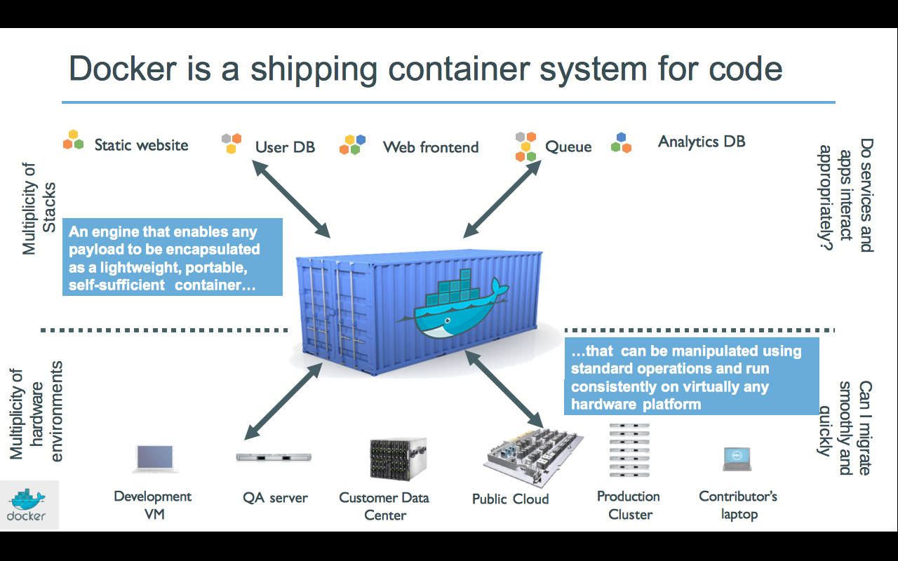
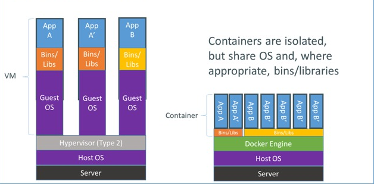
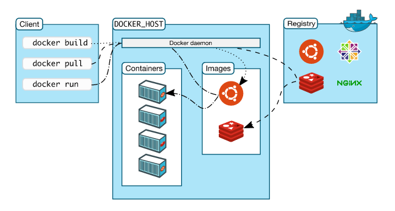
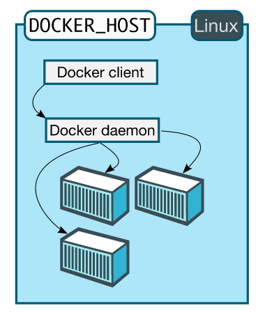
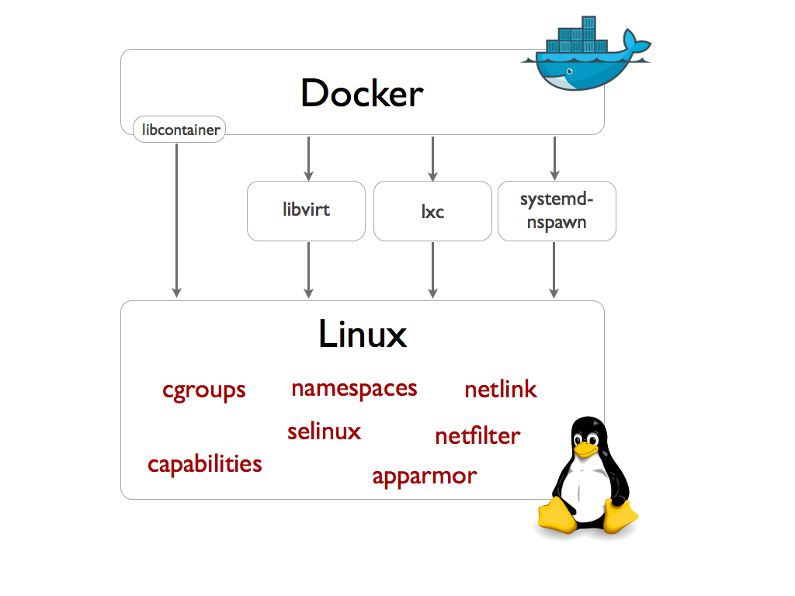
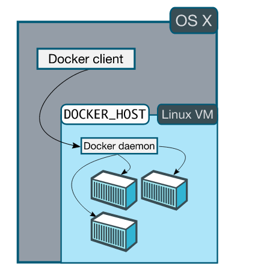

# Docker入门与实践

刘斌，软件工程师@OneAPM

# 课程简介

- 目的
- 对象
- 内容

# 对象用户

- Linux
- Git（GitHub）

# 参考资料

- 官方文档（https://docs.docker.com/）
- 《第一本Docker书》

# 什么是Docker

- Build, Ship, Run
- An open platform
- For distributed applications
- For developers and sysadmins
- https://www.docker.com
- https://www.github.com/docker/docker

# 什么是Docker

- 开放平台
- 容器技术
- 交付标准

# Docker产生背景

- 云计算技术
- 软件架构
- 面临问题

# 云计算技术

- 虚拟化技术
- IaaS
- PaaS
- SDN

# 软件架构

- SOA
- 微服务
- 12-Factor App
- Golden Image

# 依赖地狱和一致环境

- Hardware
- OS
- Library(Version etc.)
- Rails(3/4),Ruby(1.8/1.9/2.0/2.1)

# 集装箱思想

- 标准化（大小、运输方式等，接口统一）
- 隔离（互不干扰、影响）

# Docker的解决方案

# 什么是容器？

- 一组进程在独自的OS环境
- 独立文件内容
- 独立网络环境（hostname，IP地址等）
- CPU、内存分配

# 只是容器？

- Docker（2013）
- lmctfy（2013）
- LXC（2008）
- RHEL OpenVZ（2005）
- Solaris Zones（2004）
- FreeBSD jail（2000）
- chroot（????）

# 只是容器？

- chroot（1979/1982）

# Docker特点（优势）

- 简单
- 轻量
- 隔离
- 移植性
- 以应用为中心
- 版本化
- 重用
- Immutable

# 和虚拟机相比

# 和虚拟机相比

- 实现原理
- 启动时间
- 可启动实例数量
- overhead
- 安全性（隔离）
- 磁盘空间

# Docker实现原理

- Control Groups（cgroups）
- Namespace
- iptables
- Union File System
- Apparmor、SELinux等
- Kernel Capability

# cgroups

- blkio： 块设备读写限制（Read <= N bytes/sec）
- cpu： 调度器对CPU的限制
- cpuset： 多核下对CPU访问的控制
- cpuacct: CPU accounting controller
- devices： 对设备的控制
- freezer：处理的暂停和恢复
- memory： 控制内存资源的使用
- net_cls： 使用等级识别符（classid）标记网络数据包，可允许 Linux 流量控制程序（tc）识别从具体 cgroup 中生成的数据包。
- net_prio： 对不同网络接口通信的优先级别的设置

# Namespaces

- pid： 进程（PID）隔离（2.6.24）
- net： 网络隔离（2.6.26）
- ipc： IPC隔离，POSIX消息队列，共享内存（2.6.19）
- mnt： 挂载点隔离（2.4.19）
- uts： hostname，NIS域名（UTS: Unix Timesharing System）（2.6.19）
- user： 用户隔离（3.8）

# 12-Factor App

- Codebase
- Dependencies
- Config
- Build, release, run
- Processes
- Port binding
- Concurrency
- Disposability
- Dev/prod parity
- Logs

# Lesson-01 Docker将会给这些领域带来影响

- Software development
- Deploy & Delivery
- DevOps

# Docker适用场景

- 开发
- 测试
- 部署
- CI/CD
- PaaS/CaaS

# 支持平台

- Linux
- Boot2Docker（Windows 、 OS X）
- Vagrant

# Docker能干什么

- 快速交付（交付标准）
- 轻松部署和扩展
- 提高资源利用率（高密度、满负荷）

# Docker历史

- docCloud（2010 YCombinator），2013年1月内部项目
- 2013年3月，在PyCon US首次公开
- 2013/3/27 Docker 0.1
- 2014/6 Docker 1.0
- 几乎每月一个版本
- Docker 1.8

# Docker 组件

- Docker Engine 或 “Docker”
- Docker Hub
- Docker Registry
- Docker Machine
- Docker Compose
- Docker Swarm
- Docker Trusted Registry(DTR)
- Kitematic
- Docker Toolbox
- Docker Subscription

# Docker Engine架构

- C/S结构
- Remote API

# Docker in Linux

# Libcontainer

- libconatiner

# Docker Engine核心概念

- Docker镜像（image）
- Docker容器（containers）
- Docker Registry

# 镜像

- 文件系统
- 只读、静态
- 层（Layer）
- 父子关系（Parent Image）
- 基础镜像（Base Image）
- ID（64字符，256bit存储）

# 容器 - Container

- 创建、运行和退出
- ID（和镜像ID类似）

# Registry

- 托管镜像仓库（repositories of images）
- Registry API
- Docker Hub和私有Registry

# 课程演习环境

- Vagrant
- CentOS 7
- Docker 1.7.1
- 灵雀云（alauda.cn）

# Docker For Non-Linux

- Boot2Docker
- Toolbox

# Docker in Non-Linux

# Docker Toolbox (Docker 1.8)

- Docker Client
- Docker Machine
- Docker Compose (Mac only)
- Docker Kitematic
- VirtualBox

# VirtualBox和Vagrant

- 虚拟机
- 虚拟机管理软件
- hashicorp
- Serf/Consul/Packer等工具

# Vagrant

- vagrant init chef/centos-7.0
- vagrant up
- vagrant ssh

# Vagrant

- 下载centos7镜像：http://pan.baidu.com/s/1kT7u5oF
- vagrant box add chef/centos-7.0 opscode_centos-7.0_chef-provisionerless.box
- 执行上一页命令

# Vagrantfile

- box
- forwarded_port
- synced_folder

# 安装Docker

- 64位Linux
- 内核3.10

# 安装Docker

- $ sudo yum update
- $ curl -sSL https://get.docker.com/ | sh
- $ sudo systemctl enable docker
- $ sudo systemctl start docker
- $ sudo docker -v
- Docker version 1.7.1, build 786b29d

# 设置镜像加速

- 灵雀云（https://console.alauda.cn）
- --registry-mirror=http://liubin.m.alauda.cn

# 答疑

- https://github.com/liubin/docker101
- Alauda社区

# 致谢

- 开课吧
- 灵雀云（http://www.alauda.cn/）

