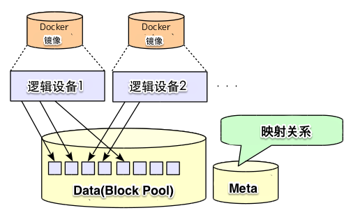
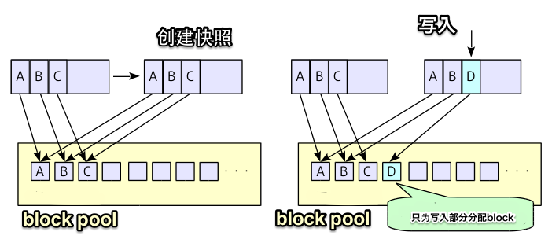
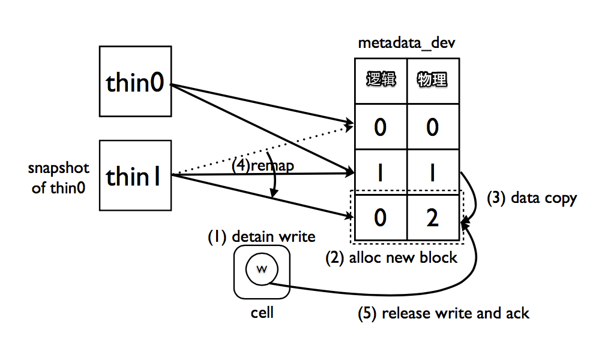

# Docker入门与实践

Lesson-03 理解Docker镜像
刘斌@OneAPM
2015年8月

# 本节概要

- 镜像构造
- 管理镜像
- 手工构建镜像
- Docker存储原理

# 什么是Docker镜像

- 容器的模板
- 分层
- manifest(json) + layers
- layer: tar包

# 分层的优势

- 轻量（磁盘空间）
- 缓存，提高构建速度

# Repository

- 存放镜像的仓库
- 有一个名字
- 一个镜像可以属于多个仓库
- docker commit
- docker build -t
- docker tag

# 仓库名称

- [registry[:port]/][user_name/](repository_name:version_tag)
- 默认index.docker.io:80

# 拉取和推送镜像

- docker search
- docker pull
- docker push

# 查看Docker镜像

- docker images
- REPO/TAG/ID
- docker history
- docker inspect
- tag
- docker rmi

# 演示1

- docker login
- docker pull
- docker tag
- docker push

# 构建镜像

- 必要性
- 方式：commit，Dockerfile，从0开始
- 优缺点：Dockerfile > commit> 从0开始

# 通过docker commit命令构建镜像

- docker run -it base bash
- # yum update && yum install xxx && exit
- docker commit 

# 演示2

- 创建nginx镜像

# docker commit 参数

- -m --message
- -a --author
- -c --changes

# commit -c可覆盖参数

- CMD、ENTRYPOINT
- ENV
- EXPOSE
- ONBUILD
- USER
- VOLUME
- WORKDIR

# 共享镜像

- 镜像存储
- 官方
- 免费+收费
- 或私有Registry

# 拷贝到其他机器

- Docker iamge = tar文件
- export/import
- save/load

# export/import

- export：整个mount，将rootfs打成一个tar包
- import：tar包解包而已
- 镜像层级关系和metadata丢失
- 不能共享层文件，占用大量磁盘空间
- 能导入物理机或者虚拟机的rootfs

# save/load

- 按镜像层分别打tar包
- 一层层mount，打包
- 先打base
- mount下一层，打包差分
- 记录metadata
- 将结果再打成一个tar包

# 演示3

- save导出镜像
- 解压查看分层

# Docker存储引擎

- CoW
- AUFS
- Device Mapper
- BTRFS
- overlay(fs)
- VFS
- ZFS

# CoW

- Copy on Write
- Copy only (when) Write
- Memory（并发编程中犹如内存管理的GC）
- Storage

# AUFS

- Advanced（Another） Union FS
- Ubuntu/Debian
- 没进内核主线
- dotCloud从2008年就开始用
- 适合高密度的类PaaS场景

# AUFS原理

- 由多个分支按一定顺序组合
- 每个只是一个普通文件夹
- 若干只读分支和一个读写分支（顶层）

# AUFS原理-读写文件

- 读取时从顶层开始查找文件
- 找到则打开
- 写入时如果在顶层找到目标文件，则打开
- 否则继续向下找
- 如果找到，则拷贝到顶层，开始写入
- 找不到则在顶层创建文件并写入

# AUFS原理-删除文件

- 创建一个whiteout文件表示删除

# 演示

- 见README.md

# AUFS优点

- 成熟度以及和Docker的融合性
- Debian/Ubuntu 内核默认支持
- mount()调用快，因此创建容器速度快
- 启动n个容器，只会从磁盘加载一次

# AUFS缺点

- Read/write操作几乎无性能损失
- open()有时候会很慢：
- 1. 文件太大（log，数据库文件）
- 2. 层级太深

# BTRFS

- B-tree file system，以大规模存储位目标
- Oracle 2007
- 受ZFS影响
- 支持快照、CoW和回滚
- CentOS 7.1可用，preview

# BTRFS

- 文件系统级别的CoW
- diff快
- 基于subvolume + snapshot
- 要求Docker运行于BTRFS之上（/var/lib/docker）
- Docker相关代码好像只有几百行

# overlay

- 内核3.18
- 类似AUFS，不过只有两个分支
- 但是每个分支也可以是overlay的
- 性能优于AUFS
- 现在需要在ext4上运行

# VFS

- 没有CoW，每次拷贝
- 不需要内核特性支持
- 浪费空间
- 慢
- 适宜移植到其他平台

# ZFS

- Solaris（现Oracle）
- 2005年发布
- Zettabyte File System
- 1 ZiB（泽字节） = 1,099,511,627,776 (1024的4次方)GiB
- 也被移植到包括Linux在内的其他OS上

# Device Mapper

- RAID（dm-raid）
- 设备加密（dm-crypt）
- 快照（snapshots）
- 延迟写入（dm-delay）
- Docker未使用LVS
- Docker : thin-provisioning + snapshot

# thin provisioning

- dm-thin/dm-thinp
- 如果一个block没有被写入，则不会真正分配物理磁盘
- 可超卖
- 数据存放在两个文件，data和metadata
- metadata保存着快照中虚拟位移和pool中物理位移的对应关系
- data 也叫做block pool（block：默认64KB，最大1G）
- 默认data大小100GB（meta为2G）
- 镜像大小10GB
- 可以分配大于10个的容器

# Device Mapper

图片来源： http://www.school.ctc-g.co.jp/columns/nakai/nakai59.html

# Device Mapper

图片来源： http://www.school.ctc-g.co.jp/columns/nakai/nakai59.html

# Device Mapper

# Device Mapper

- 块级别而不是文件级别的CoW
- 随时对镜像（->容器）或者容器（->镜像）做快照
- 不依赖于文件系统（在FS之下）

# Device Mapper相关命令

- docker info
- losetup
- 设备名： docker-MAJ:MIN-INO
- MAJ： block major
- MIN： block minor
- INO： inode number

# 演示

- 见README.md

# Device Mapper优点

- 容器自己的block设备
- 指定文件系统类型
- 可共享block

# Device Mapper缺点

- 不能直接查看layer之间的diff
- docker diff慢
- data和metadata基于sparse文件
- loop device而不是真正的/dev设备
- 每启动1次容器，都需要从磁盘加载一次
- 崩溃报告较多

# 课后作业

- docker pull
- docker history|inspect
- docker images/rmi
- docker commit

